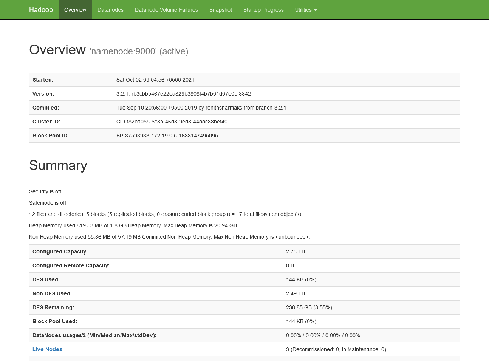
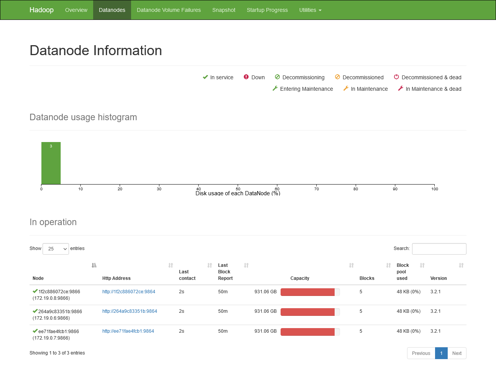
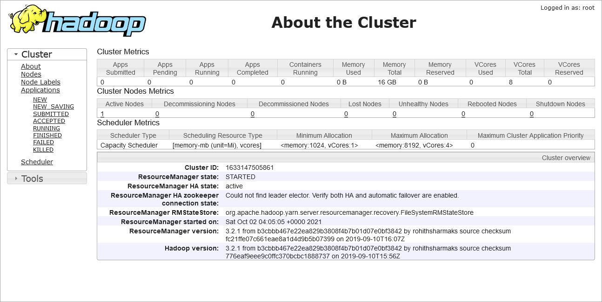

# HW01

## Блок 1. Развертывание локального кластера Hadoop





## Блок 2. Работа с HDFS

#### См. флаги “-mkdir” и “-touchz“

1. Создайте папку в корневой HDFS-папке

> hdfs dfs -mkdir /data


2. Создайте в созданной папке новую вложенную папку.

> hdfs dfs -mkdir /data/temp


3. Что такое Trash в распределенной FS? Как сделать так, чтобы файлы удалялись сразу, минуя “Trash”?

        При исполнении команды hdfs dfs -rm файлы не удаляются, а перемещаются в директорию Trash.
        Для немедленного удаления используется ключ -skipTrash.


4. Создайте пустой файл в подпапке из пункта 2.

> hdfs dfs -touchz /data/temp/text


5. Удалите созданный файл.

> hdfs dfs -rm -skipTrash /data/temp/text


6. Удалите созданные папки.

> hdfs dfs -rm -r -skipTrash /data


#### См. флаги “-put”, “-cat”, “-tail”, “-cp”

1. Скопируйте любой файл в новую папку на HDFS

> docker cp ./text docker-hadoop:/text
>
> hdfs dfs -put /text /data/ 


2. Выведите содержимое HDFS-файла на экран.

> hdfs dfs -cat /data/text


3. Выведите содержимое нескольких последних строчек HDFS-файла на экран.

> hdfs dfs -tail /data/text
>
> hdfs dfs -cat /data/text | tail -n 3


4. Выведите содержимое нескольких первых строчек HDFS-файла на экран.

> hdfs dfs -head /data/text
>
> hdfs dfs -cat /data/text | head -n 3


5. Переместите копию файла в HDFS на новую локацию.

> hdfs dfs -cp /data/text /text_copy


#### См. флаги “-setrep -w”, “-files - blocks -locations”

1. Изменить replication factor для файла. Как долго занимает время на увеличение / уменьшение числа реплик для файла?

    Создадим 3 реплики.
        
> hdfs dfs -setrep -w 3 /data/text

        Replication 3 set: /data/text
        Waiting for /data/text .... done
        Процесс занял порядка 10 секунд.

    Уменьшим количество реплик до 2х.
> hdfs dfs -setrep -w 2 /data/text

        Replication 2 set: /data/text
        Waiting for /data/text ...
        WARNING: the waiting time may be long for DECREASING the number of replications.
        . done
        
    Процесс уменьшения реплик занял порядка 15 секунд.


2. Найдите информацию по файлу, блокам и их расположениям.
> hdfs fsck /data/text -files -blocks -locations

        Connecting to namenode via http://namenode:9870/fsck?ugi=root&files=1&blocks=1&locations=1&path=%2Fdata%2Ftext

        FSCK started by root (auth:SIMPLE) from /172.19.0.5 for path /data/text at Sat Oct 02 06:26:19 UTC 2021
        ?/data/text 56 bytes, replicated: replication=3, 1 block(s):  OK

        0. BP-37593933-172.19.0.5-1633147495095:blk_1073741830_1006 len=56 Live_repl=3  [DatanodeInfoWithStorage[172.19.0.7:9866,DS-f3a01852-7883-48b1-a195-b8f0ac9e63fe,DISK], DatanodeInfoWithStorage[172.19.0.6:9866,DS-0f405296-7607-49d6-ad9d-54d0f31cde83,DISK], DatanodeInfoWithStorage[172.19.0.8:9866,DS-819df643-f57f-427e-877f-dbcad337fae2,DISK]]


        Status: HEALTHY
         Number of data-nodes:	3
         Number of racks:		1
         Total dirs:			0
         Total symlinks:		0

        Replicated Blocks:
         Total size:	56 B
         Total files:	1
         Total blocks (validated):	1 (avg. block size 56 B)
         Minimally replicated blocks:	1 (100.0 %)
         Over-replicated blocks:	0 (0.0 %)
         Under-replicated blocks:	0 (0.0 %)
         Mis-replicated blocks:		0 (0.0 %)
         Default replication factor:	3
         Average block replication:	3.0
         Missing blocks:		0
         Corrupt blocks:		0
         Missing replicas:		0 (0.0 %)

        Erasure Coded Block Groups:
         Total size:	0 B
         Total files:	0
         Total block groups (validated):	0
         Minimally erasure-coded block groups:	0
         Over-erasure-coded block groups:	0
         Under-erasure-coded block groups:	0
         Unsatisfactory placement block groups:	0
         Average block group size:	0.0
         Missing block groups:		0
         Corrupt block groups:		0
         Missing internal blocks:	0
        FSCK ended at Sat Oct 02 06:26:19 UTC 2021 in 0 milliseconds


        The filesystem under path '/data/text' is HEALTHY

3. Получите информацию по любому блоку из п.2 с помощью "hdfs fsck -blockId”. Обратите внимание на Generation Stamp (GS number).

> hdfs fsck -blockId blk_1073741830
        
        Connecting to namenode via http://namenode:9870/fsck?ugi=root&blockId=blk_1073741830+&path=%2F
        FSCK started by root (auth:SIMPLE) from /172.19.0.5 at Sat Oct 02 06:41:00 UTC 2021

        Block Id: blk_1073741830
        Block belongs to: /data/text
        No. of Expected Replica: 3
        No. of live Replica: 3
        No. of excess Replica: 0
        No. of stale Replica: 0
        No. of decommissioned Replica: 0
        No. of decommissioning Replica: 0
        No. of corrupted Replica: 0
        Block replica on datanode/rack: 1f2c886072ce/default-rack is HEALTHY
        Block replica on datanode/rack: 264a9c83351b/default-rack is HEALTHY
        Block replica on datanode/rack: ee71fae4fcb1/default-rack is HEALTHY

У выбранного блока(blk_1073741830_1006) GS number равен 1006.


## Блок 3. Написание map-reduce на Python

1. Скачен AB_NYC_2019.csv.

2. Проведен анализ в Jupyter Notebook, посчитаны среднее значение и дисперсия.

> Среднее: 152.7206871868289
>
> Дисперсия: 57672.84569843345


3. Поскольку задача маппера в этих задачах одинаковая - вернуть цену, то у меня получилось 3 скрипта.

        Для запуска скриптов на python были изменены Dockerfile (добавлена установка Python 3.5) для nodemanager и datanode.
        
        Запуск скрипта для расчетов:
        
    ```
    hadoop jar /opt/hadoop-3.2.1/share/hadoop/tools/lib/hadoop-streaming-3.2.1.jar -files mapper.py,reducer_mean.py -mapper "/usr/bin/python3 mapper.py" -reducer "/usr/bin/python3 reducer_mean.py" -input /data/AB_NYC_2019.csv -output /mean
    ```


    Результат работы:

        2021-10-02 10:32:34,622 INFO mapreduce.Job: The url to track the job: http://resourcemanager:8088/proxy/application_1633170510807_0002/
        2021-10-02 10:32:34,623 INFO mapreduce.Job: Running job: job_1633170510807_0002
        2021-10-02 10:32:38,660 INFO mapreduce.Job: Job job_1633170510807_0002 running in uber mode : false
        2021-10-02 10:32:38,660 INFO mapreduce.Job:  map 0% reduce 0%
        2021-10-02 10:32:43,688 INFO mapreduce.Job:  map 50% reduce 0%
        2021-10-02 10:32:44,691 INFO mapreduce.Job:  map 100% reduce 0%
        2021-10-02 10:32:47,700 INFO mapreduce.Job:  map 100% reduce 100%
        2021-10-02 10:32:47,704 INFO mapreduce.Job: Job job_1633170510807_0002 completed successfully
        2021-10-02 10:32:47,744 INFO mapreduce.Job: Counters: 54
            File System Counters
                FILE: Number of bytes read=77705
                FILE: Number of bytes written=854278
                FILE: Number of read operations=0
                FILE: Number of large read operations=0
                FILE: Number of write operations=0
                HDFS: Number of bytes read=7082245
                HDFS: Number of bytes written=23
                HDFS: Number of read operations=11
                HDFS: Number of large read operations=0
                HDFS: Number of write operations=2
                HDFS: Number of bytes read erasure-coded=0
            Job Counters 
                Launched map tasks=2
                Launched reduce tasks=1
                Rack-local map tasks=2
                Total time spent by all maps in occupied slots (ms)=10044
                Total time spent by all reduces in occupied slots (ms)=10480
                Total time spent by all map tasks (ms)=2511
                Total time spent by all reduce tasks (ms)=1310
                Total vcore-milliseconds taken by all map tasks=2511
                Total vcore-milliseconds taken by all reduce tasks=1310
                Total megabyte-milliseconds taken by all map tasks=10285056
                Total megabyte-milliseconds taken by all reduce tasks=10731520
            Map-Reduce Framework
                Map input records=49081
                Map output records=48895
                Map output bytes=467363
                Map output materialized bytes=78018
                Input split bytes=176
                Combine input records=0
                Combine output records=0
                Reduce input groups=1
                Reduce shuffle bytes=78018
                Reduce input records=48895
                Reduce output records=1
                Spilled Records=97790
                Shuffled Maps =2
                Failed Shuffles=0
                Merged Map outputs=2
                GC time elapsed (ms)=58
                CPU time spent (ms)=2290
                Physical memory (bytes) snapshot=1027244032
                Virtual memory (bytes) snapshot=18761109504
                Total committed heap usage (bytes)=3407872000
                Peak Map Physical memory (bytes)=347418624
                Peak Map Virtual memory (bytes)=5138644992
                Peak Reduce Physical memory (bytes)=332464128
                Peak Reduce Virtual memory (bytes)=8484130816
            Shuffle Errors
                BAD_ID=0
                CONNECTION=0
                IO_ERROR=0
                WRONG_LENGTH=0
                WRONG_MAP=0
                WRONG_REDUCE=0
            File Input Format Counters 
                Bytes Read=7082069
            File Output Format Counters 
                Bytes Written=23
        2021-10-02 10:32:47,745 INFO streaming.StreamJob: Output directory: /mean


    Также и расчет дисперсии:

```
hadoop jar /opt/hadoop-3.2.1/share/hadoop/tools/lib/hadoop-streaming-3.2.1.jar -files mapper.py,reducer_var.py -mapper "/usr/bin/python3 mapper.py" -reducer "/usr/bin/python3 reducer_var.py" -input /data/AB_NYC_2019.csv -output /var
```

    Результат работы:
    
        2021-10-02 10:36:49,932 INFO impl.YarnClientImpl: Submitted application application_1633170510807_0003
        2021-10-02 10:36:49,950 INFO mapreduce.Job: The url to track the job: http://resourcemanager:8088/proxy/application_1633170510807_0003/
        2021-10-02 10:36:49,951 INFO mapreduce.Job: Running job: job_1633170510807_0003
        2021-10-02 10:36:53,988 INFO mapreduce.Job: Job job_1633170510807_0003 running in uber mode : false
        2021-10-02 10:36:53,989 INFO mapreduce.Job:  map 0% reduce 0%
        2021-10-02 10:36:58,016 INFO mapreduce.Job:  map 50% reduce 0%
        2021-10-02 10:36:59,020 INFO mapreduce.Job:  map 100% reduce 0%
        2021-10-02 10:37:02,029 INFO mapreduce.Job:  map 100% reduce 100%
        2021-10-02 10:37:02,033 INFO mapreduce.Job: Job job_1633170510807_0003 completed successfully
        2021-10-02 10:37:02,075 INFO mapreduce.Job: Counters: 54
            File System Counters
                FILE: Number of bytes read=77705
                FILE: Number of bytes written=854263
                FILE: Number of read operations=0
                FILE: Number of large read operations=0
                FILE: Number of write operations=0
                HDFS: Number of bytes read=7082245
                HDFS: Number of bytes written=21
                HDFS: Number of read operations=11
                HDFS: Number of large read operations=0
                HDFS: Number of write operations=2
                HDFS: Number of bytes read erasure-coded=0
            Job Counters 
                Launched map tasks=2
                Launched reduce tasks=1
                Rack-local map tasks=2
                Total time spent by all maps in occupied slots (ms)=9856
                Total time spent by all reduces in occupied slots (ms)=9960
                Total time spent by all map tasks (ms)=2464
                Total time spent by all reduce tasks (ms)=1245
                Total vcore-milliseconds taken by all map tasks=2464
                Total vcore-milliseconds taken by all reduce tasks=1245
                Total megabyte-milliseconds taken by all map tasks=10092544
                Total megabyte-milliseconds taken by all reduce tasks=10199040
            Map-Reduce Framework
                Map input records=49081
                Map output records=48895
                Map output bytes=467363
                Map output materialized bytes=78018
                Input split bytes=176
                Combine input records=0
                Combine output records=0
                Reduce input groups=1
                Reduce shuffle bytes=78018
                Reduce input records=48895
                Reduce output records=1
                Spilled Records=97790
                Shuffled Maps =2
                Failed Shuffles=0
                Merged Map outputs=2
                GC time elapsed (ms)=56
                CPU time spent (ms)=2350
                Physical memory (bytes) snapshot=1036443648
                Virtual memory (bytes) snapshot=18760785920
                Total committed heap usage (bytes)=3413639168
                Peak Map Physical memory (bytes)=350928896
                Peak Map Virtual memory (bytes)=5138137088
                Peak Reduce Physical memory (bytes)=339316736
                Peak Reduce Virtual memory (bytes)=8484737024
            Shuffle Errors
                BAD_ID=0
                CONNECTION=0
                IO_ERROR=0
                WRONG_LENGTH=0
                WRONG_MAP=0
                WRONG_REDUCE=0
            File Input Format Counters 
                Bytes Read=7082069
            File Output Format Counters 
                Bytes Written=21
        2021-10-02 10:37:02,075 INFO streaming.StreamJob: Output directory: /var
    
    Результат работы скриптов располагается в каталогах hdfs:/mean и hdfs:/var соответственно.
    

4. Проверим результат работы    
    
    Посмотрим на данные:
    
        root@b2a69591cf9f:/# hdfs dfs -ls /mean
        Found 2 items
        -rw-r--r--   3 root supergroup          0 2021-10-02 10:32 /mean/_SUCCESS
        -rw-r--r--   3 root supergroup         21 2021-10-02 10:32 /mean/part-00000    

        root@b2a69591cf9f:/# hdfs dfs -cat /mean/part-00000
        mean	152.7206871868289

    
    
        root@b2a69591cf9f:/# hdfs dfs -ls /var
        Found 2 items
        -rw-r--r--   3 root supergroup          0 2021-10-02 10:37 /var/_SUCCESS
        -rw-r--r--   3 root supergroup         21 2021-10-02 10:37 /var/part-00000    

        root@b2a69591cf9f:/# hdfs dfs -cat /var/part-00000
        var	57672.8456984328


    Мы видим, что рассчитанные через map-reduce данные совпадают с прямым расчетом. Для дисперсии расхождение начинается с 9го знака после запятой. Данное различие может быть вызвано различными версиями Python.
