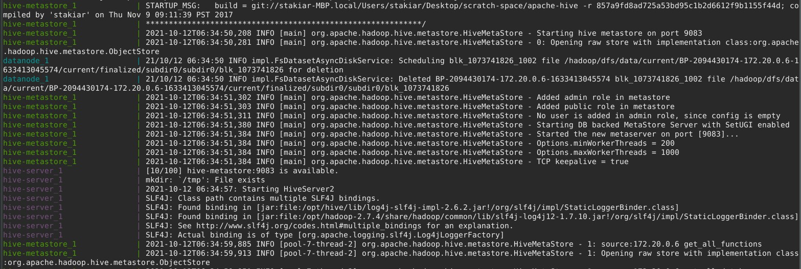
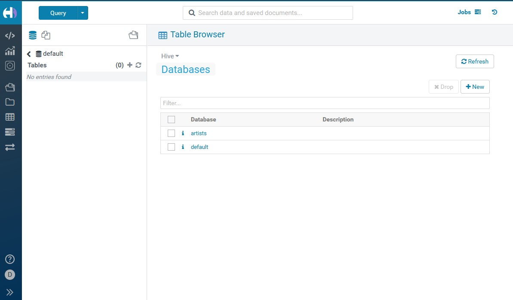
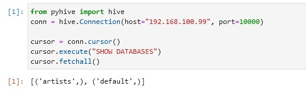
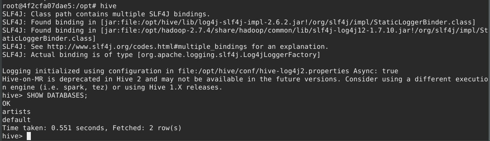
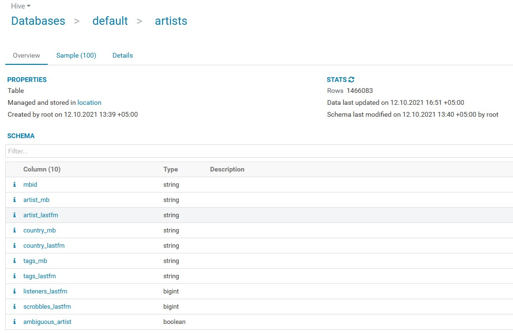

# Домашнее задание №2


## Блок 1. Развертывание локального Hive

### Развернуть локальный Hive

Использовалась конфигурация c [https://github.com/tech4242/docker-hadoop-hive-parquet](https://github.com/tech4242/docker-hadoop-hive-parquet)



### Подключиться к развернутому Hive с помощью нескольких инструментов








## Блок 2. Работа с Hive

### Сделать табличку artists в Hive



Не удалось напрямую через HUE закачать файл. Пришлось ручками положить в hdfs и затем создать таблицу на основе файла.


### Исполнитель с максимальным числом скробблов

```SQL
SELECT artist_lastfm, scrobbles_lastfm 
FROM `default`.`artists` 
ORDER BY scrobbles_lastfm DESC 
LIMIT 1;
```

&nbsp; |   artist_lastfm    | scrobbles_lastfm
------ | ------------ | ------
1 | The Beatles | 517126254


### Самый популярный тэг на ластфм

```SQL
WITH tags as (
    SELECT trim(tags) as tag, count(*) AS cnt FROM `default`.`artists`
    LATERAL VIEW explode(split(tags_lastfm, ";")) tags_lastfm AS tags 
    WHERE trim(tags) > "" 
    GROUP BY trim(tags) 
    ORDER BY cnt DESC 
    LIMIT 10
)
SELECT tag FROM tags;
```

&nbsp; |   tag 
------ | ---
1 | seen live
2 | rock
3 | electronic
4 | under 2000 listeners
5 | All
6 | pop
7 | indie
8 | alternative
9 | experimental
10 | female vocalists


### Самые популярные исполнители 10 самых популярных тегов

```SQL
WITH top_tags as (
    SELECT trim(tags) as tag, count(*) AS cnt FROM `default`.`artists`
    LATERAL VIEW explode(split(tags_lastfm, ";")) tags_lastfm AS tags 
    WHERE trim(tags) > "" 
    GROUP BY trim(tags) 
    ORDER BY cnt DESC 
    LIMIT 10
),
artists as (
    SELECT artist_lastfm, scrobbles_lastfm, trim(tags) as tags FROM `default`.`artists`
    LATERAL VIEW explode(split(tags_lastfm, ";")) tags_lastfm AS tags 
    WHERE trim(tags) > "" 
)
SELECT artist_lastfm, scrobbles_lastfm FROM artists
WHERE tags in (select tag from top_tags)
GROUP BY artist_lastfm, scrobbles_lastfm
ORDER BY scrobbles_lastfm DESC
LIMIT 10;
```

&nbsp; | artist_lastfm | scrobbles_lastfm
------ | ------------- | ----------------
1 | The Beatles | 517126254
2 | Radiohead | 499548797
3 | Coldplay | 360111850
4 | Muse | 344838631
5 | Arctic Monkeys | 332306552
6 | Pink Floyd | 313236119
7 | Linkin Park | 294986508
8 | Red Hot Chili Peppers | 293784041
9 | Lady Gaga | 285469647
10 | Metallica | 281172228


### Любой другой инсайт

**Страны, с самым большим количеством исполнителей**

```SQL
SELECT country, count(*) AS cnt FROM `default`.`artists`
  LATERAL VIEW explode(split(country_lastfm, "; ")) country_lastfm as country
WHERE country > "" 
GROUP BY country 
ORDER BY cnt DESC LIMIT 10;
```

&nbsp; |   country    | cnt
------ | ------------ | ------
1 | United States | 41706
2 | United Kingdom | 25832
3 | Germany | 21654
4 | Japan | 20512
5 | France | 16023
6 | Sweden | 13418
7 | Russia | 10431
8 | Italy | 9930
9 | Canada | 9909
10 | Spain | 9644

Ожидаемо на 1м месте США.


**Топ-10 артистов из России**

```SQL
SELECT artist_lastfm, scrobbles_lastfm AS cnt FROM `default`.`artists`
  LATERAL VIEW explode(split(country_lastfm, "; ")) country_lastfm as country
WHERE country = "Russia" 
GROUP BY artist_lastfm, scrobbles_lastfm
ORDER BY scrobbles_lastfm DESC LIMIT 10;
```

&nbsp; | artist_lastfm | cnt
------ | ------------- | ------
1 | Regina Spektor | 86879173
2 | Сплин | 30642848
3 | Exo | 28552853
4 | Gogol Bordello | 25723861
5 | t.A.T.u. | 24282244
6 | Zемфира | 22106841
7 | Noize MC | 20772736
8 | Король и Шут | 18910852
9 | Lumen | 17579969
10 | Ляпис Трубецкой | 14779954

Странный выбор подписчиков Last.fm, но в принципе Регина Спектр (по данным вики) родилась в СССР, возможно поэтому ее относят к России. Ну и пользователей данного сервиса в США больше, что и объясняет ее победу в данном рейтинге.
